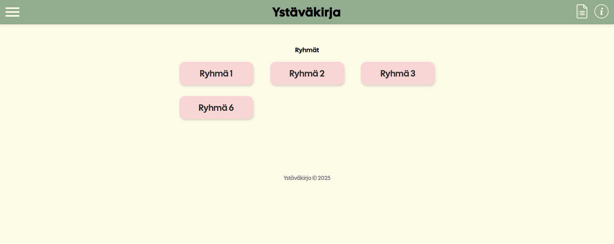
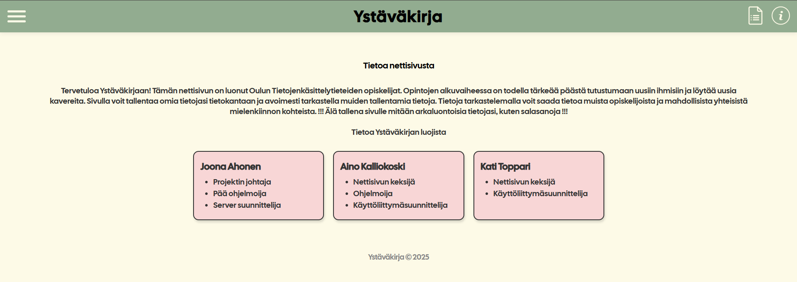

# Ystäväkirja

Ystäväkirja on nettisivu, jonka tarkoituksena on kerätä lyhyitä profiileja ihmisistä ja jakaa profiileja ryhmiin. Frontend on toteutettu käyttämällä HTML, CSS ja JS. Backend toteutuksena Node.js palvelin, joka käyttää Google Sheets:iä tietokantana. Sovelluksen on toteuttanut Tietojenkäsittelytieteiden opiskelijat. Sovellusta on tarkoitus käyttää uusien Tietojenkäsittelytieteiden opiskelijoiden ryhmäyttämiseen Oulun Yliopistossa.

---

## Kuvia

---

## Ominaisuudet

- Tallennetaan tiedot (groupID, name, age, birth, hobby) Google Sheettiin
- Luetaan kaikki rivit Sheetistä ja muutetaan tiedot käytettävään JSON muotoon
- Frontend sivut:
  - index.html — etusivu; sisältää napit jokaiselle ryhmälle
  - groupview.html — sisältää ryhmän jäsenten tietoja (käyttäen `?groupId=...`)
  - form.html — lomake tietojen lähettämiseen (kesken)
  - infopage.html — sisältää tietoa nettisivusta

---

## Projektin rakenne (tärkeät)

- src/backend/server.js — Express palvelin, Sheets API käyttö
- src/backend/.env — ympäristönmuuttujat, arkaluontoiset tiedot (EI COMMITATTU)
- src/backend/utils/transformJSON.js — muuttaa API:sta JSON:in käytettävään muotoon
- src/frontend/index.html, groupview.html, form.html, infopage.html — Käyttöliittymä sivut
- src/frontend/groupBoxRender.js — luo linkit ryhmille
- src/frontend/peopleBoxRender.js — lukee ryhmän `?groupId` printtaa ryhmän jäsenet
- src/frontend/style.css — ulkoasu, käyttäjäystävällisyys, elementtien muotoilu

---

## Oletukset

- Node.js
- npm
- Google Cloud projekti jossa Google Sheets API käytössä

---

## Palvelimen käyttöönotto

1.  - Avaa terminaali `src/backend`:
      - Windows PowerShell:
        - cd "c:...\Ystavakirja_2025\src\backend"
        - npm install

2.  Luo "service account" Google Cloudissa. Kytke Google Sheets API päälle ja lataa JSON key.

3.  Jaa Google Sheet tiedosto service accountin sähköpostiosoitteelle (muista muokkausoikeudet).

4.  Luo `src/backend/.env`:

    - GOOGLE_CLIENT_EMAIL (service account sähöposti)
    - GOOGLE_PRIVATE_KEY (avain joka vastaa sähköpostia)
    - GOOGLE_SHEET_ID (sheetin tunnus, jota halutaan muokata)

5.  Käynnistä palvelin:
    - `src/backend`, komento:
      - `node server.js`
    - Pitäisi lukea:
      - `Server running at http://localhost:3000/`

---

## Kehitys

- Avaa `src/frontend/index.html` selaimessa
- Muokkaa HTML/JS/CSS tiedostoja
- Käytä VSCode Liveserver lisäosaa

---

## Yhteystiedot

- Joona Ahonen: joona.ahonen@student.oulu.fi
- Aino Kalliokoski: -
- Kati Toppari: -

---

## Tulevaisuuden suunnitelmia

- Käyttäjien autentikaatio
- Profiilikuva tai piirtokenttä jokaiselle käyttäjälle
- Parempi UI/UX
- Tumma teema

---
